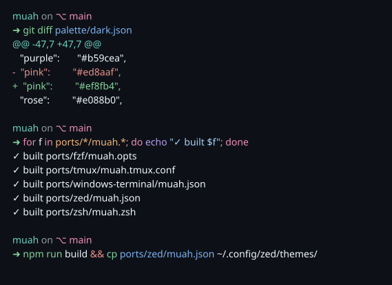

# muah

A pastel dark theme with a pop of pink. 💋



Currently ships ports for:
- **Zed** (`ports/zed/muah.json`)
- **Windows Terminal** (`ports/windows-terminal/muah.json`)
- **tmux** (`ports/tmux/muah.tmux.conf`)
- **fzf** (`ports/fzf/muah.opts`)
- **zsh** — fast-syntax-highlighting (`ports/zsh/muah.zsh`)

## Install

### Zed

Copy `ports/zed/muah.json` into Zed's user themes directory, then pick **muah** from the theme selector.

```
mkdir -p ~/.config/zed/themes
cp ports/zed/muah.json ~/.config/zed/themes/muah.json
```

### Windows Terminal

Open `settings.json` (Ctrl+, → "Open JSON file"), find the top-level `"schemes"` array, and paste the entire object from `ports/windows-terminal/muah.json` into it. Then set `"colorScheme": "muah"` on a profile.

### tmux

Drop the generated config into your tmux config directory and source it from your main `.tmux.conf`:

```bash
mkdir -p ~/.config/tmux
cp ports/tmux/muah.tmux.conf ~/.config/tmux/muah.conf

# then add to ~/.tmux.conf:
#   source-file ~/.config/tmux/muah.conf

# reload tmux to apply:
tmux source-file ~/.tmux.conf
```

### fzf

Drop the opts file in your fzf config dir and point fzf at it via `FZF_DEFAULT_OPTS_FILE` (requires fzf ≥ 0.42).

```bash
mkdir -p ~/.config/fzf
cp ports/fzf/muah.opts ~/.config/fzf/muah.opts

# then add to your shell init (~/.zshrc / ~/.bashrc):
#   export FZF_DEFAULT_OPTS_FILE=~/.config/fzf/muah.opts
```

Open a new shell and hit Ctrl+R to verify.

### zsh (fast-syntax-highlighting)

Overrides the `FAST_HIGHLIGHT_STYLES` color table with muah palette values. Must be sourced **after** `zdharma-continuum/fast-syntax-highlighting` has loaded.

```bash
mkdir -p ~/.config/zsh
cp ports/zsh/muah.zsh ~/.config/zsh/muah.zsh

# then in your zsh init AFTER fast-syntax-highlighting loads:
#   source ~/.config/zsh/muah.zsh
```

Reload (`exec zsh`) and type any command — keywords like `if`/`for`/`function` render pink, commands green, paths sky blue, strings light blue, comments grey.

## Iteration loop

After the one-time install above:

```
# edit palette/dark.json (or templates/*)
npm run build && cp ports/zed/muah.json ~/.config/zed/themes/muah.json
# Zed picks up the change automatically
```

## Project layout

```
palette/dark.json              single source of truth — named hex values
templates/                     per-app templates with {{token}} placeholders
ports/                         generated output (do not edit by hand)
assets/preview.svg             README hero — regenerated from the palette
scripts/build.js               zero-dep Node generator
scripts/preview.js             builds assets/preview.svg via `freeze`
```

## Building

```
npm run build
```

Reads `palette/dark.json`, expands every template in `templates/`, writes the result to the matching path under `ports/`, then regenerates `assets/preview.svg` via [`freeze`](https://github.com/charmbracelet/freeze) (must be on `PATH`).

## Contributing

Edit `palette/dark.json` or any file in `templates/`, then run `npm run build` and commit the regenerated `ports/`.

The build script supports two token forms:
- `{{name}}` — resolves to the palette hex (with `ff` alpha for hex-based formats).
- `{{name:XX}}` — overrides the alpha byte (e.g. `{{red:1a}}` → `#ff7b721a`).
